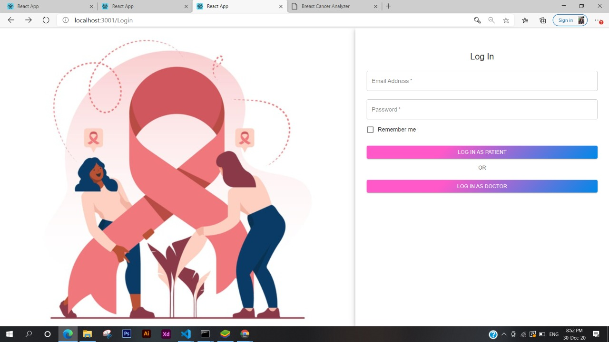
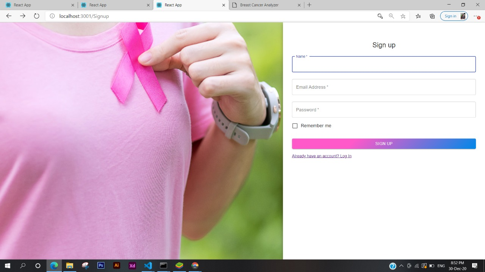
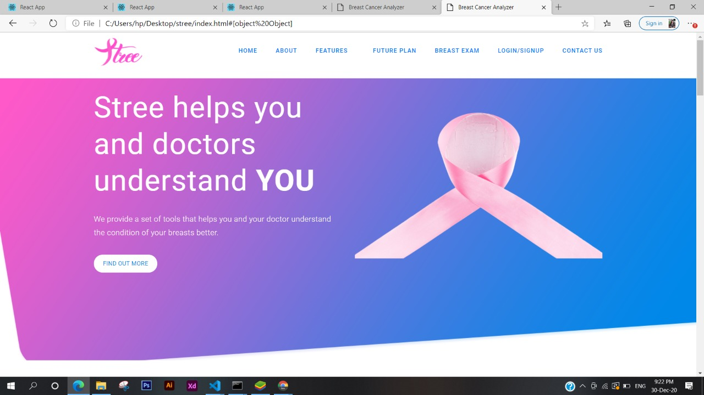
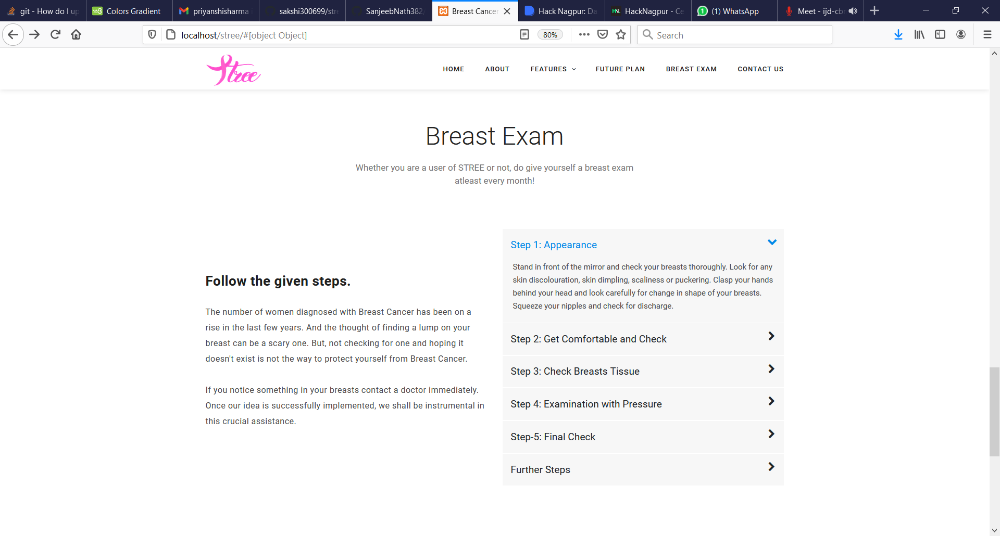
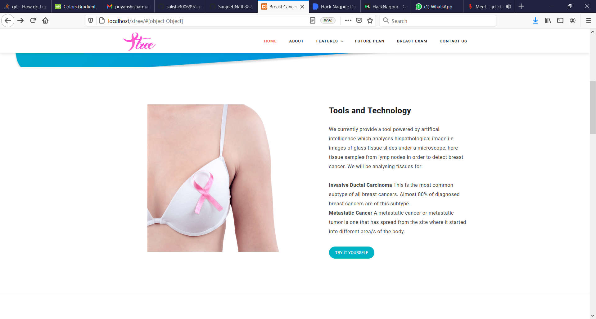
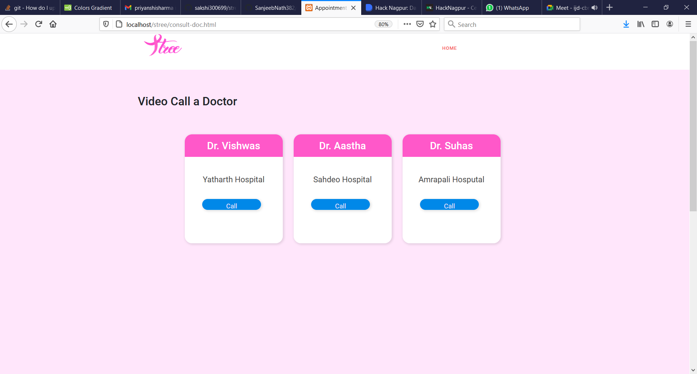
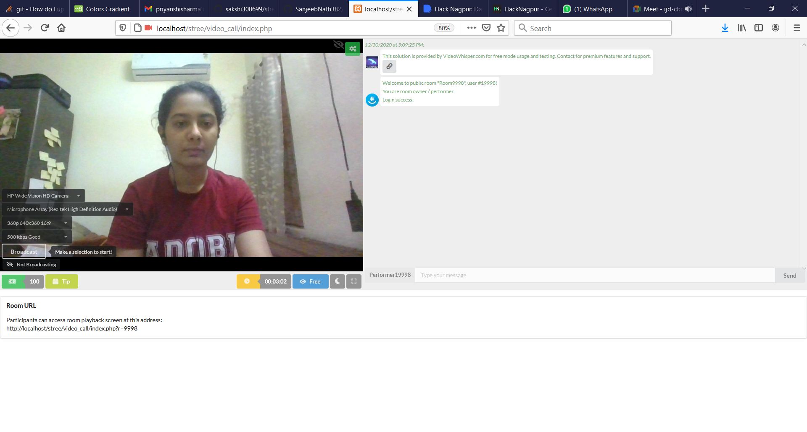
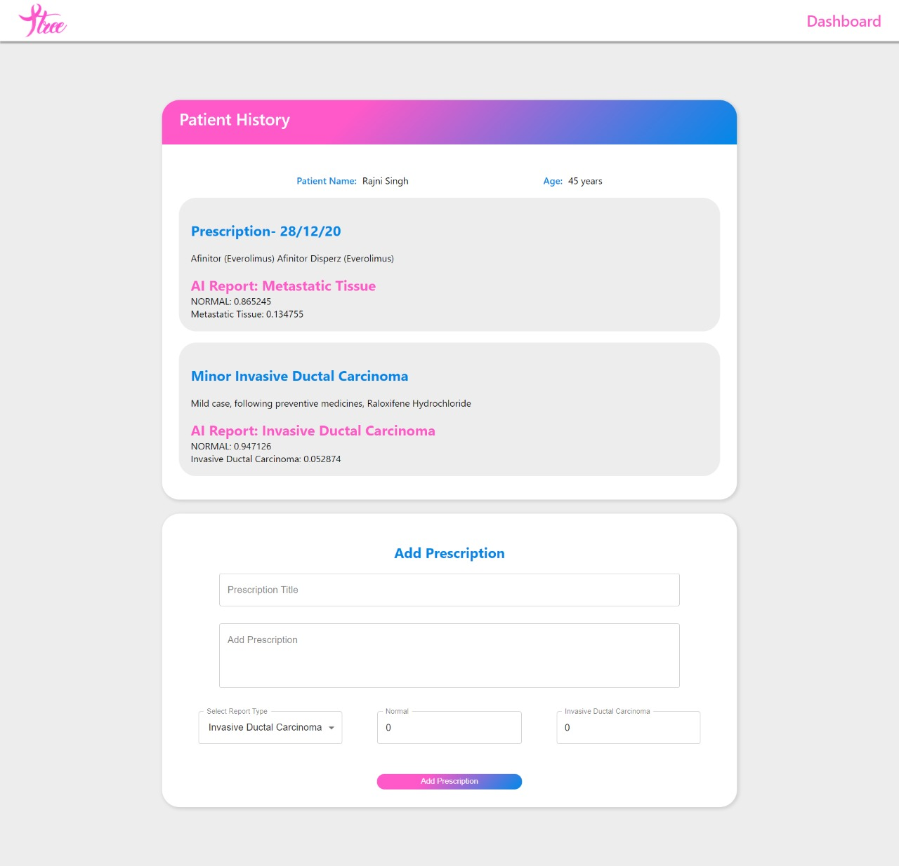
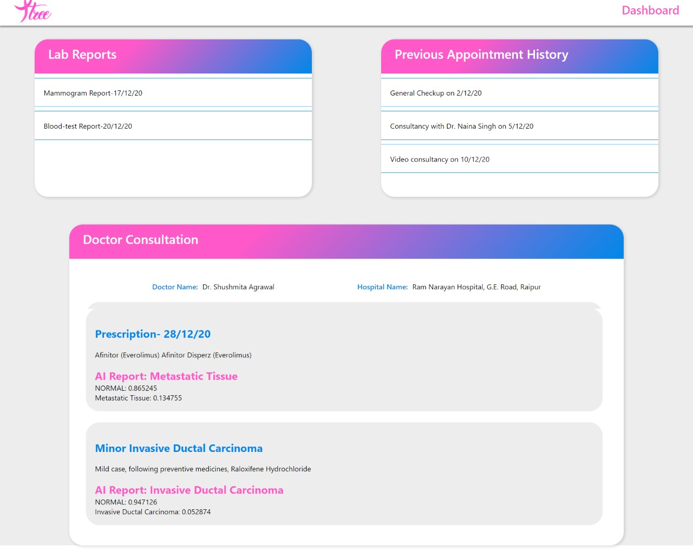

# Stree

<p>Stree is an initiative to raise awareness about breast cancer among women, eases and advances the process of diagnosis of breast cancer by the doctors. It gives doctors a supporting pair of eyes, and patients a complete vision with a prompt application that makes lives safer and reduces medical errors. This is HackDivas' Official submission for Hack Nagpur 2020 Hackathon.</p>
<p align="center">
    
  </a>
  
<p>Breast cancer is the most common invasive cancer in women and the second leading cause of cancer death in women after lung cancer. Understanding it's risk and affect to a women's life, we aim to provide a platfrom for you and your doctors to understand the condition of your breasts. We primarily provide the tool of Breast Cancer Analyser, that accepts Histopathological Image of the breasts along with the prediction type to give the results. There are also guidelines on the importance of Breast Exam and how it can be performed. We are also working towards the feature to connect with the doctor over a video conference, for the patient to connect with the doctor and understand the patient and diagnosis better. We also connect the patient and doctors with dedicated dashboards, while keeping track of their diagnosis i.e. storing and giving prescriptions, lab reports etc. on our platform, such that important information cannot be missed out.</p>

## Features
* Responsive UI for Accessibility
* User Auhentication
* Breast Cancer Detection tool : Detects 2 types of cancers using 2 AI Models
* Dedicated Dashboard for Patient and Doctor
* Booking Lab/Appointment
* Video Conferencing
* Previous Prescription & Medical History

### Sample User Credentials
* Username - sampleuser@gmail.com
* Password - 123456

## Instructions to use Video Conferencing Functionality:

- Download and Install Xampp using link  :- https://www.apachefriends.org/download.html
- Download the Zip or clone the repository using command : -
``` bash
git clone https://github.com/priyanshisharma/stree.git
```
- Go to the directory where Xampp is installed. For eg. C:\xampp\htdocs
- Copy the project folder and paste it in the address mentioned above.
- Launch any browser window and search localhost/stree.

## Technology Stack

### Web Technology

- Frontend
  - HTML
  - CSS
  - JavaScript
  - React JS
  
- Backend
  - PHP (Used for Video-call Implementation)
  - Firebase

- Tools
  - Xampp
  - Git
  - Github

## Breast Cancer Prediction Tool

In order to detect cancer, a pathologist examines the slide of tissue under a microscope. S/he visually ensures that there's no cancer and ultimately find malignant areas. We currently provide a tool powered by artifical intelligence which analyses hispathological image i.e. images of glass tissue slides under a microscope, here tissue samples from lymph nodes in order to detect breast cancer. We will be analysing tissues for:

* **Invasive Ductal Carcinoma** - This is the most common subtype of all breast cancers. Almost 80% of diagnosed breast cancers are of this subtype.
* **Metastatic Cancer** - A metastatic cancer or metastatic tumor is one that has spread from the site where it started into different area/s of the body.

We  use the 'Breast Histopathology Images' dataset available at https://www.kaggle.com/c/histopathologic-cancer-detection.

* **IDC_model** 
    * Accuracy: 0.88
    * F1 Score: 0.88

* **Metastatic_model** 
    * Accuracy: 0.94
    * F1 Score: 0.94

References
* https://www.researchgate.net/publication/263052166_Automatic_detection_of_invasive_ductal_carcinoma_in_whole_slide_images_with_Convolutional_Neural_Networks
* https://academic.oup.com/gigascience/article/7/6/giy065/5026175

## Screenshots














## Team HackDivas

* Priyanshi Sharma
* Anjali Patle
* Sakshi Bhandarkar

### More power to women!

